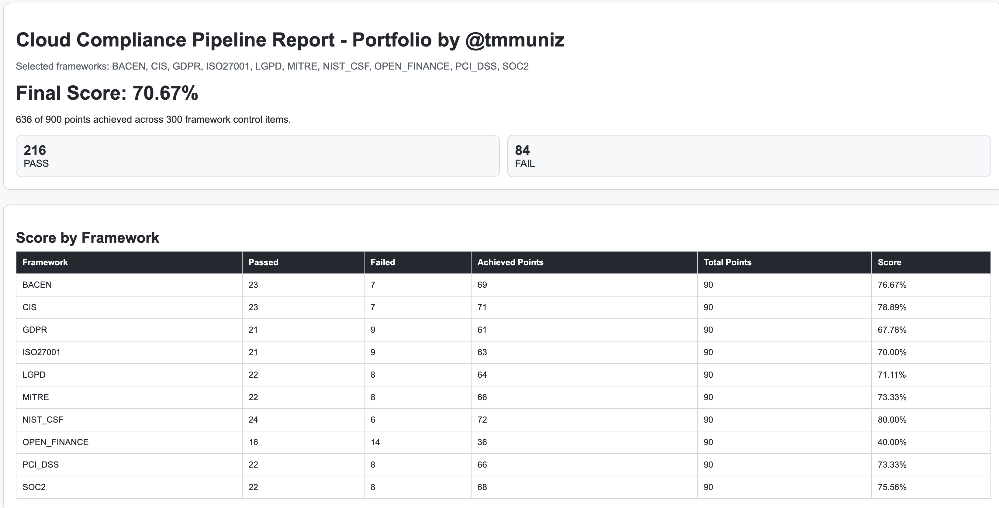
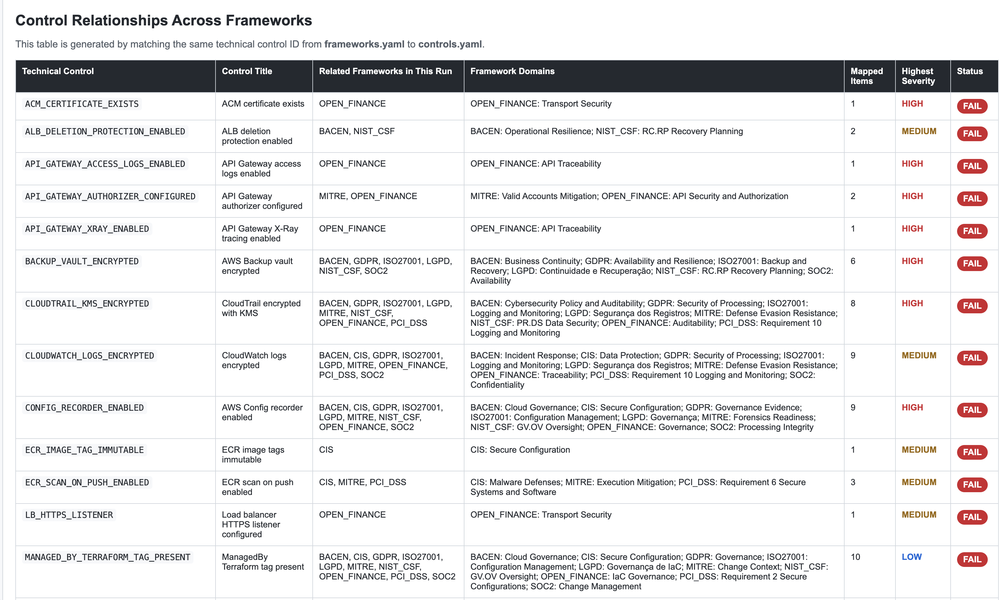
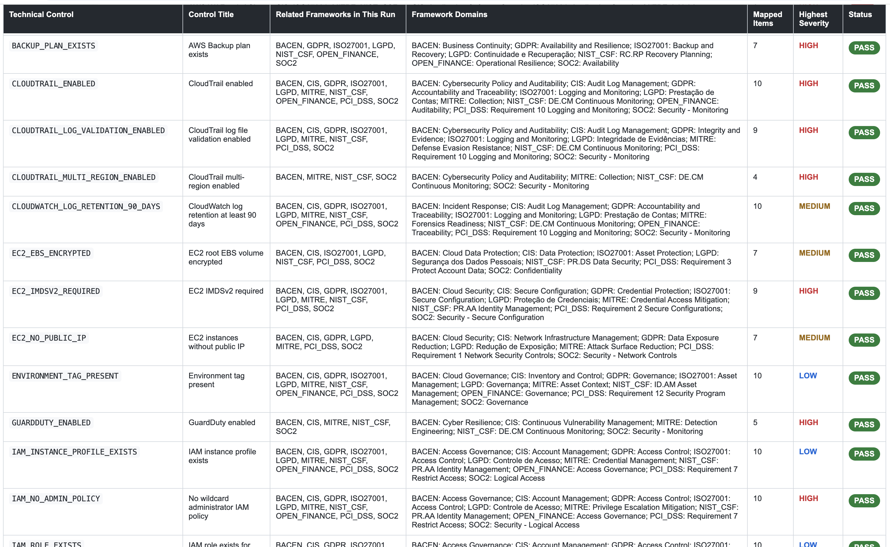
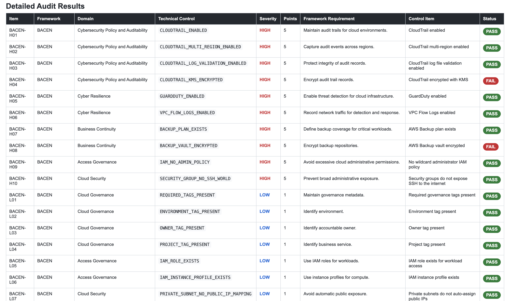
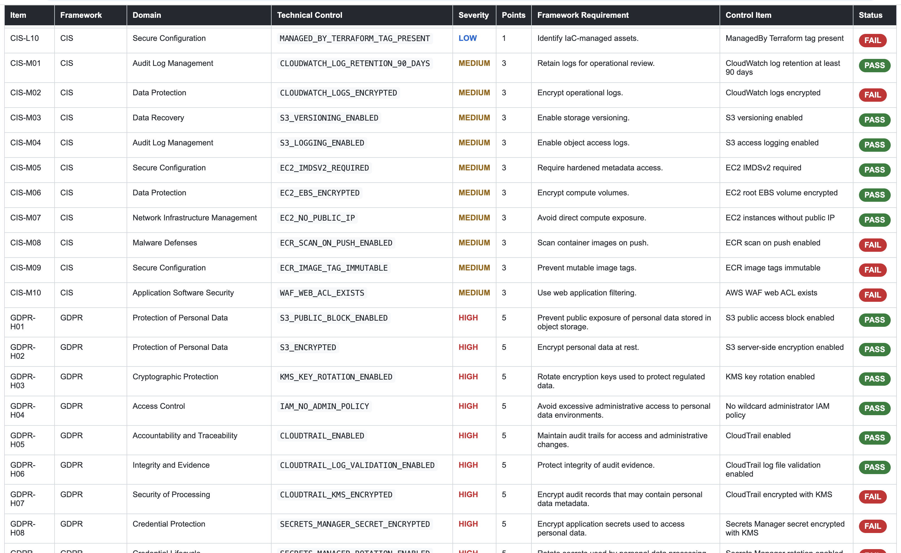

# Cloud Compliance Pipeline

## Overview

This project is a practical **Cloud Compliance & Security Automation Pipeline** focused on demonstrating modern:

* Compliance-as-Code & Policy-as-Code
* Cloud Governance & Continuous Compliance
* DevSecOps

The solution analyzes **Terraform** execution plans for **AWS** environments and evaluates them against multiple international and Brazilian security and compliance frameworks using **OPA/Rego** and **Python-based** compliance processing and reporting automation.

### International Frameworks

* GDPR
* NIST CSF
* CIS Controls
* ISO 27001
* PCI DSS
* SOC 2
* MITRE ATT&CK

### Brazilian Regulations

* LGPD
* BACEN
* Open Finance Brasil

---

# Main Features

## Compliance-as-Code

Reusable security and governance controls implemented through centralized OPA/Rego policies.

## Policy-as-Code

Security requirements are codified and automatically validated during CI/CD execution.

---

# Technologies Used

| Technology     | Purpose                |
| -------------- | ---------------------- |
| Terraform      | Infrastructure as Code |
| AWS            | Cloud Platform         |
| OPA/Rego       | Policy Engine          |
| GitHub Actions | CI/CD                  |
| Python         | Report Processing      |
| HTML           | Audit Reporting        |
| S3             | Evidence Storage       |

---

# Workflow Overview

```text
Terraform IaC
      ↓
terraform plan -> tfplan.json
      ↓
OPA/Rego Evaluation
      ↓
Framework Mapping
      ↓
JSON Evidence & HTML Compliance Report
      ↓
S3 Administrative Bucket
```

---

# Main Capabilities

## Terraform Security Analysis

The pipeline evaluates Terraform plans before deployment.

Examples:

* Public exposure detection
* IAM privilege escalation
* Missing encryption
* Missing CloudTrail
* Public Security Groups
* Missing VPC Flow Logs
* Missing GuardDuty
* Missing KMS rotation
* Missing backup plans
* Missing IMDSv2

---

# Example Controls

## HIGH Severity

* Public SSH exposure
* Public RDP exposure
* IAM admin policy detection
* Missing encryption
* Public subnet exposure

## MEDIUM Severity

* Missing VPC Flow Logs
* Missing CloudTrail multi-region
* Missing backup plan
* Missing GuardDuty

## LOW Severity

* Missing governance tags
* Missing confidentiality tags
* Missing retention configuration

# Severity Model

| Severity | Score |
| -------- | ----- |
| HIGH     | 5     |
| MEDIUM   | 3     |
| LOW      | 1     |

---

# Heterogeneous Framework Modeling

Each framework has:

* Independent domains
* Different controls
* Different severities
* Different requirements
* Independent scoring

---

## DRY Architecture

The project uses centralized reusable control definitions.

### Technical Controls

```text
policy/controls.yaml
```

Contains:

* Technical controls
* Control metadata
* OPA check mapping

---

### Framework Mapping

```text
policy/frameworks.yaml
```

Contains:

* Framework domains
* Severity
* Scoring
* Regulatory requirements
* Control association

---

### Rego Policies

```text
policy/compliance.rego
```

Contains:

* Terraform resource evaluation logic
* OPA policies
* AWS security validations

---

# Repository Structure

```text
.
├── .github/
│   └── workflows/
│       └── compliance.yml
│
├── policy/
│   ├── compliance.rego
│   ├── controls.yaml
│   └── frameworks.yaml
│
├── scripts/
│   ├── evaluate.py
│   ├── merge_results.py
│   └── render_html.py
│
├── terraform/
```

---

# Workflow Execution

## 1. Framework Selection

The workflow supports:

```text
ALL
```

Or specific frameworks:

```text
GDPR,NIST_CSF,PCI_DSS
```

Using GitHub Actions manual inputs.

---

## 2. Terraform Plan Generation

The workflow generates the Terraform execution plan:

```bash
terraform init
terraform plan
terraform show -json tfplan > tfplan.json
```

---

## 3. OPA/Rego Evaluation

OPA evaluates the Terraform plan against all technical controls.

---

## 4. Framework

Each framework is evaluated independently.

Benefits:

* Parallel execution
* Better scalability
* Easier debugging
* Independent scoring
* More realistic audit behavior

---

## 5. JSON Evidence Generation

Each framework generates its own evidence file:

```text
reports/results-gdpr.json
reports/results-pci-dss.json
reports/results-lgpd.json
```

---

## 6. Result Consolidation

All framework results are merged into:

```text
reports/results.json
```

---

## 7. HTML Report Generation

The consolidated report is transformed into:

```text
reports/compliance-report.html
```

---

## 8. Administrative Evidence Upload

Final evidence files are uploaded to an administrative S3 bucket.

Uploaded files:

```text
results.json
compliance-report.html
framework-results/
```

---

# GitHub Actions Variables

Configure these variables in:

```text
Settings → Secrets and variables → Actions
```

| Variable              | Description              |
| --------------------- | ------------------------ |
| AWS_REGION            | AWS region               |
| TERRAFORM_BUCKET_NAME | Terraform backend bucket |
| ARN_OIDC_TERRAFORM    | AWS OIDC role            |
| ADMIN_BUCKET_NAME     | Administrative S3 bucket |

---

# Security Practices

## OIDC Federation

The workflow uses AWS OIDC federation to avoid long-lived credentials.

## Secure Terraform Backend

Terraform state is stored securely in S3.

## Shift Left Security

Compliance validation happens before infrastructure deployment.

## Immutable Evidence Storage

Audit evidence is uploaded to S3 for retention and traceability.

---

# HTML Reporting

The pipeline generates a centralized HTML report containing:

* Framework
* Domain
* Requirement
* Technical control
* Severity
* Status
* Compliance score







---
# Future Improvements

* Multi-cloud support
* Kubernetes/K8s controls
* CIS Benchmark integration
* Security exception workflows
* Dashboard visualization
* Compliance APIs
* Real-time notifications
* Compliance-as-Code
